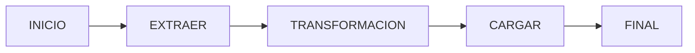
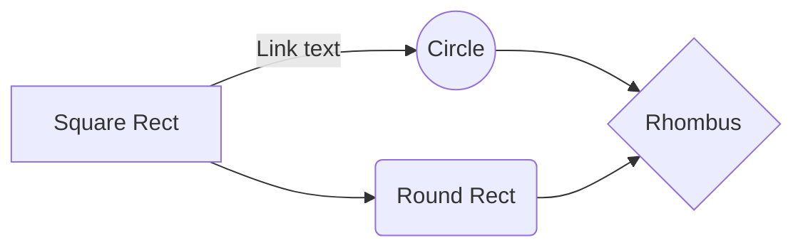

### General:
---
- **Autor**: Docente
- **Creación**: `2024-04-22`
- **Correo_Contacto**: 'ianrj19@gmail.com'
- **Última revisión**: '2024-04-22`

Link: [Repositorio_Creado](https://github.com/IanRJ19/PEDE3_Airflow.git)

### Parametros utilizados

|                |DESARROLLO                          |PRODUCCION                         |STAGGIN                         |
|----------------|-------------------------------|-----------------------------|-----------------------------|
|Owner |`'Desarrollador'`            |`'Docente'`         |`'Inspector'`            |
|Retries          |`5`            |`1`             |`1`            |

### DAG Realizado

### Purpose:
{One or two paragraphs explaining what you are doing with the data and why you need it.}
 
- **Business**: {TEXT eg: More revenue ...}
- **Technical**: {TEXT eg: Automate sales team ...}
 
### Support:
- In case you need help, reach out to:
   - **Internal Customer**: {TEXT: Include emails and description on how reach out}
   - **External users/support** : {TEXT: It mean third party data, vendor, etc}
 
### How does the DAG work?
{TEXT: A brief list explaining the steps that the DAG uses to accomplish the ETL.}
 
- {TEXT}
- {TEXT}
- {TEXT: the quantity depends on how many bullets you need}
 
### Documentation:
{Put here only the links to documentation, keep the format and add them as you need}
 
- **User guide**: [Link name]({url})
- **Technical guide**: [Link name]({url})
- **Vendors**: [Link name]({url})
- **Training**: [Link name]({url})
- **Link to API docs**: [Link name]({url})

### Failure/Rollback/Notify Strategy:
##### Rollback Strategy:
- {TEXT: A brief explanation of how the failures and rollbacks have to be handled.}
##### Notify strategy:
- {TEXT: Also should note any notification strategies, Like "please contact the x team(s) if this fails twice in a row or doesn't recover within 2 hours."}
### Notes
 
{TEXT: Considerations, special cases, etc. Whatever you consider the most important to know about the DAG. API and airflow requirements to my documentation. For example, if OU account, api key, or variables are needed. ADD ALL THE TOPICS THAT DO NOT FIT IN THE OTHER SECTIONS}.
 
- **{WHATEVER}**: {TEXT}
     - **{WHATEVER}**: {TEXT}
 
### Change log:
[comment]: <> (Keep the table format and quotes at ticket number and dates)
 
| Date                | Author            | Jira Ticket  | Summary              |
| :---------:         |    :--------:     |  :--------:  |  :------             |
| `{date yyyy-mm-dd}` |  {User name}      | `{ticket}`   |  {TEXT: eg: First release}    |
| `{date yyyy-mm-dd}` |  {User name}      | `{ticket}`   |  {TEXT: like a commit comment} . |